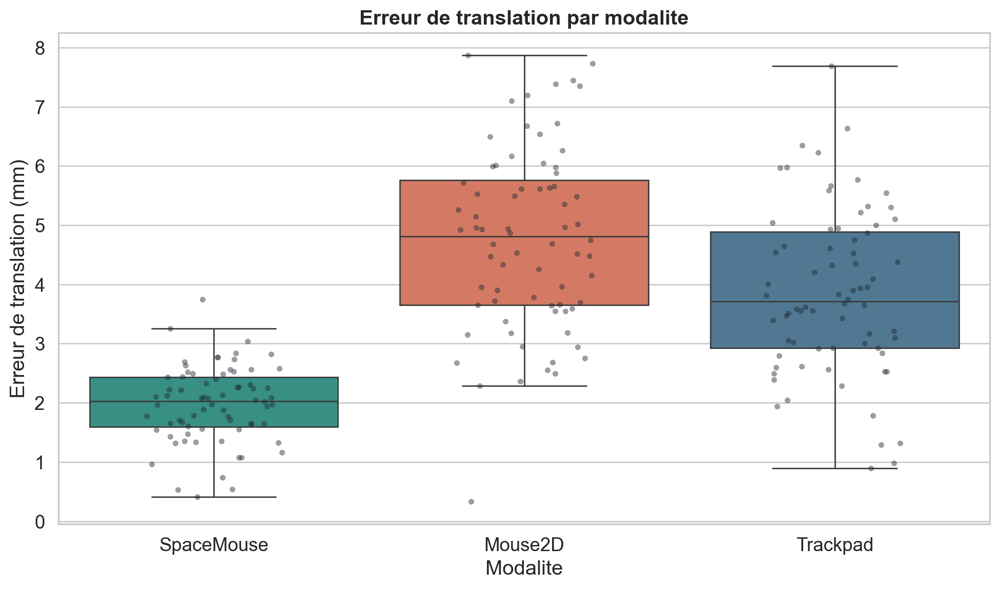
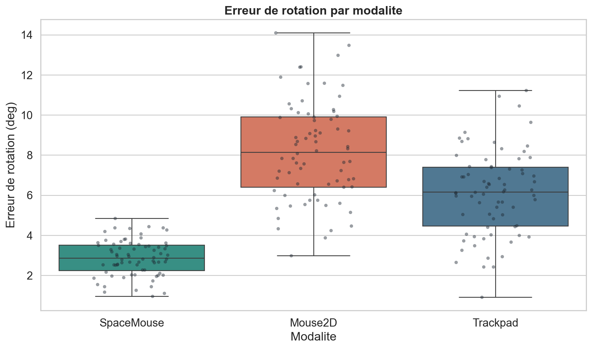
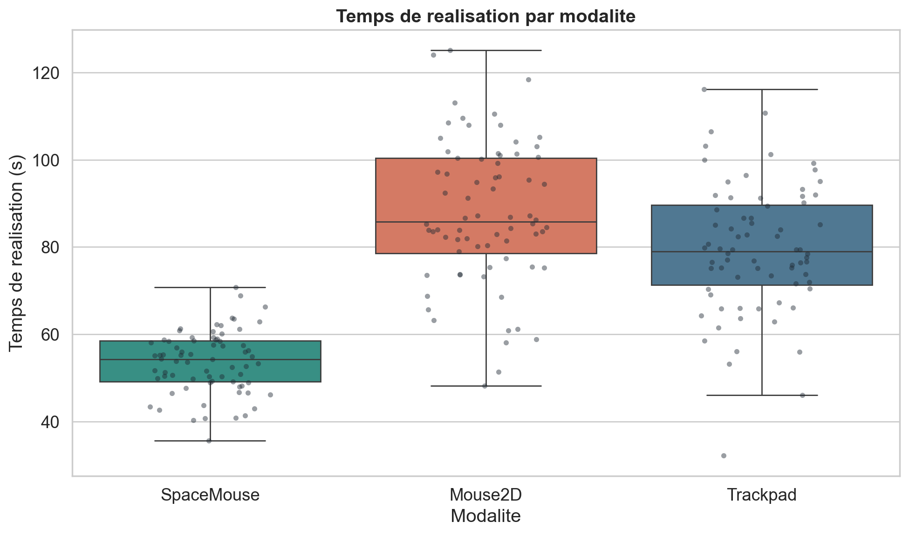
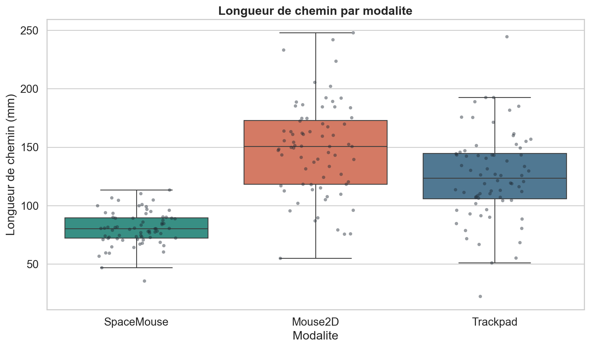
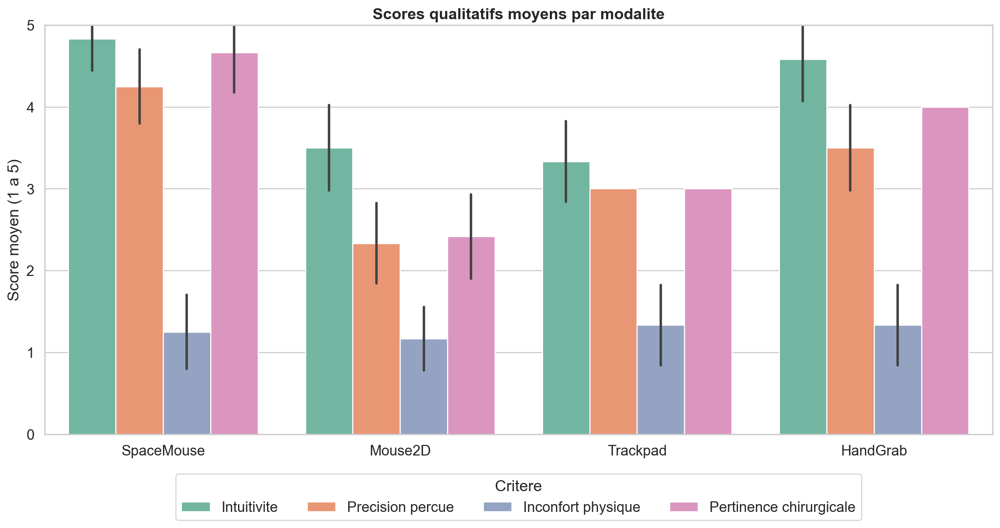
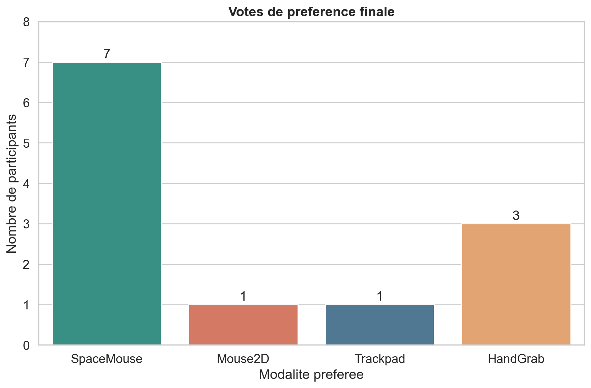
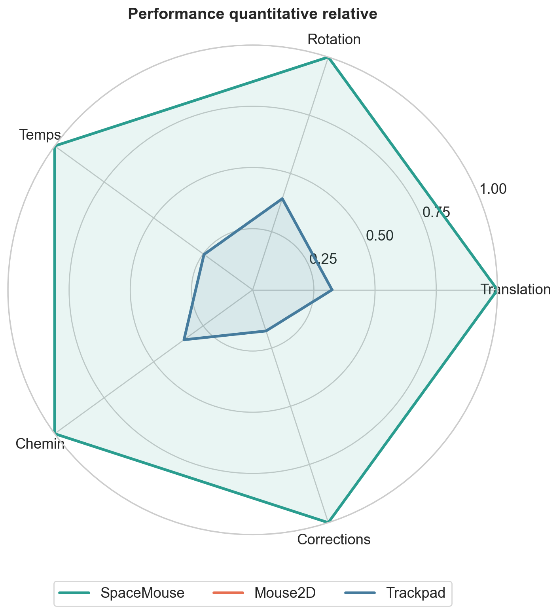

# Interaction 3D Log Analysis

Ce depot presente un travail final realise dans le cadre de mon stage autour de la validation de modalites d'interaction avec un modele 3D. L'objectif etait de comparer plusieurs manieres de manipuler un objet 3D dans un contexte medico-chirurgical simule, puis de construire une methode simple, reproductible et interpretable pour analyser les resultats.

Le projet ne cherche pas a produire une validation clinique. Il sert a demontrer une demarche d'analyse : structurer des logs, extraire des metriques depuis des matrices de transformation, comparer les modalites, visualiser les resultats et formuler une conclusion argumentee.

## Objectif

L'objectif principal est de comparer les modalites suivantes :

- `SpaceMouse`
- `Mouse2D`
- `Trackpad`
- `HandGrab`

Une distinction importante est faite entre l'analyse quantitative et l'analyse qualitative.

L'analyse quantitative compare uniquement `SpaceMouse`, `Mouse2D` et `Trackpad`, car ces modalites disposent de matrices de transformation comparables. `HandGrab` est integre uniquement a l'analyse qualitative, car il a ete evalue a travers les retours utilisateurs et ne possede pas de logs matriciels comparables dans cette version du travail.

## Methode choisie

Pour eviter de modifier directement le logiciel principal, j'ai choisi de construire une chaine d'analyse independante en Python. Cette approche permet de tester la methode sur un jeu de donnees representatif, de verifier les calculs et de produire des visualisations directement exploitables.

La methode suit quatre etapes :

1. Generation locale d'un jeu de donnees representatif.
2. Calcul des metriques quantitatives a partir des matrices 4x4.
3. Analyse statistique par modalite.
4. Visualisation et interpretation des resultats.

Les donnees generees localement ne sont pas versionnees dans ce depot. Le depot contient uniquement le code, les figures et la documentation necessaires pour comprendre et reproduire l'analyse.

## Justification technique

Chaque essai quantitatif contient deux matrices de transformation :

- `target_matrix` : position et orientation attendues du modele 3D ;
- `final_matrix` : position et orientation obtenues a la fin de l'essai.

La matrice d'erreur relative est calculee avec :

```text
T_error = inverse(T_target) @ T_final
```

A partir de cette matrice, deux metriques principales sont extraites :

- l'erreur de translation, calculee comme une distance euclidienne en millimetres ;
- l'erreur de rotation, calculee en degres a partir de la trace de la matrice de rotation.

D'autres indicateurs completent l'analyse :

- temps de realisation ;
- longueur du chemin ;
- nombre de corrections ;
- succes de l'essai ;
- scores qualitatifs issus d'un questionnaire.

Cette approche est adaptee au probleme, car elle relie directement les performances observees a la geometrie de la manipulation 3D.

## Resultats quantitatifs

Les resultats montrent que la `SpaceMouse` obtient les erreurs de translation les plus faibles et la dispersion la plus reduite. `Mouse2D` presente les erreurs les plus elevees, tandis que `Trackpad` se situe dans une position intermediaire.



La meme tendance apparait sur l'erreur de rotation. `SpaceMouse` reste la modalite la plus precise, alors que `Mouse2D` et `Trackpad` montrent davantage de variabilite, en particulier pour les rotations fines.



Le temps de realisation est egalement plus favorable pour `SpaceMouse`. Cette modalite permet de terminer les essais plus rapidement, ce qui suggere une meilleure efficacite dans la manipulation 3D.



La longueur du chemin confirme cette interpretation. Une trajectoire plus courte indique une manipulation plus directe, avec moins d'hesitations ou de detours.



Le nombre de corrections est plus faible avec `SpaceMouse`, ce qui renforce l'idee d'une interaction plus stable et mieux controlee.


## Resultats qualitatifs

L'analyse qualitative inclut les quatre modalites : `SpaceMouse`, `Mouse2D`, `Trackpad` et `HandGrab`.

`SpaceMouse` obtient de bons scores en precision percue et en pertinence chirurgicale. `HandGrab` ressort positivement sur l'intuitivite, ce qui est coherent avec une interaction plus naturelle. En revanche, il reste separe de l'analyse quantitative faute de matrices comparables.



Les votes de preference finale confirment cette lecture : `SpaceMouse` est la modalite majoritaire, suivie par `HandGrab`. `Trackpad` et `Mouse2D` sont moins souvent choisis comme modalite preferee.



## Synthese comparative

Le radar ci-dessous resume les performances quantitatives relatives. Plus une modalite occupe une surface importante, meilleure est sa performance globale sur les indicateurs mesures.



La `SpaceMouse` apparait comme la modalite la plus equilibree : elle combine precision, rapidite, stabilite et faible nombre de corrections. `Trackpad` reste utilisable, mais son controle est moins stable. `Mouse2D` est familiere, mais moins adaptee aux manipulations 3D fines.

## Installation

```bash
python -m venv .venv
source .venv/bin/activate
pip install -r requirements.txt
```

Sur Windows PowerShell :

```powershell
python -m venv .venv
.venv\Scripts\Activate.ps1
pip install -r requirements.txt
```

## Execution

Depuis la racine du projet :

```bash
python src/01_generate_synthetic_data.py
python src/02_compute_metrics_from_transforms.py
python src/03_statistical_analysis.py
python src/04_plot_results.py
```

Les fichiers CSV generes par ces scripts restent locaux et sont ignores par Git.

## Structure du projet

```text
interaction-3d-log-analysis/
|-- README.md
|-- requirements.txt
|-- .gitignore
|-- src/
|   |-- 01_generate_synthetic_data.py
|   |-- 02_compute_metrics_from_transforms.py
|   |-- 03_statistical_analysis.py
|   |-- 04_plot_results.py
|   `-- utils/
|       |-- transformations.py
|       `-- statistics.py
|-- data/
|   |-- raw/.gitkeep
|   |-- interim/.gitkeep
|   `-- processed/.gitkeep
`-- figures/
    |-- 01_boxplot_translation_error.png
    |-- 02_boxplot_rotation_error.png
    |-- 03_boxplot_completion_time.png
    |-- 04_boxplot_path_length.png
    |-- 05_boxplot_nb_corrections.png
    |-- 06_qualitative_scores_by_modality.png
    |-- 07_preference_votes.png
    `-- 08_summary_radar_optional.png
```

## Conclusion

Cette analyse montre que la `SpaceMouse` offre le meilleur compromis entre precision, efficacite et stabilite pour la manipulation d'un modele 3D dans ce contexte simule. Elle produit les erreurs les plus faibles, necessite moins de corrections et permet des trajectoires plus directes.

`Trackpad` reste une solution utilisable, mais moins stable. `Mouse2D` conserve l'avantage de la familiarite, mais elle est moins adaptee aux rotations et ajustements 3D fins. `HandGrab` est interessant qualitativement, notamment pour son intuitivite, mais il doit etre analyse separement tant que des logs matriciels comparables ne sont pas disponibles.

Le projet met donc en evidence une demarche complete de validation : collecte ou generation de logs, calcul de metriques, analyse statistique, visualisation et interpretation critique des resultats.
